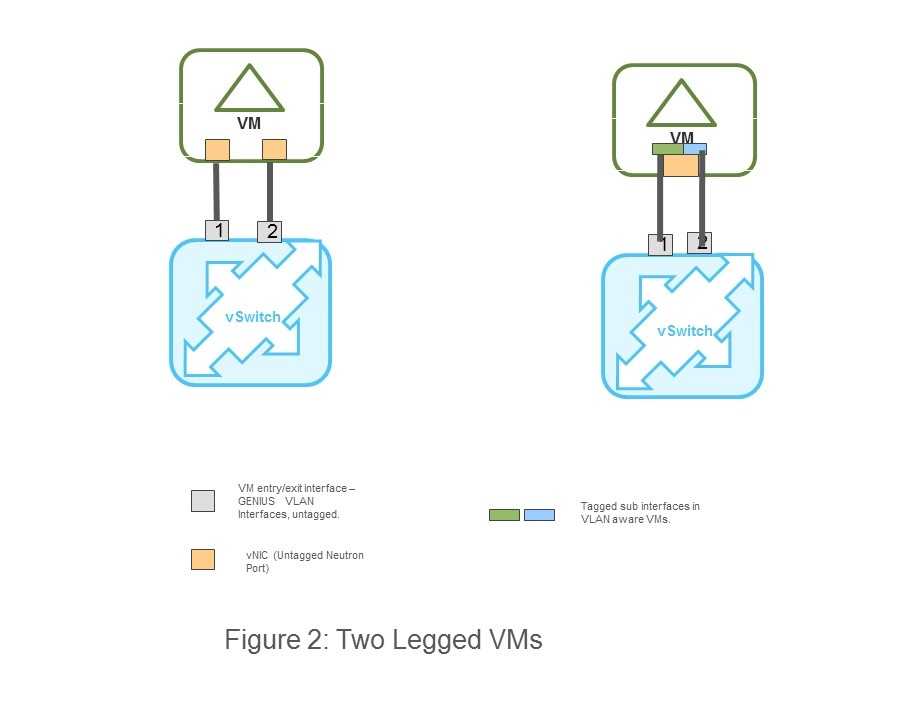
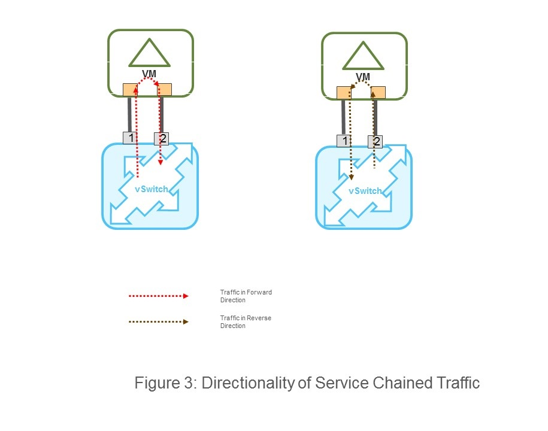
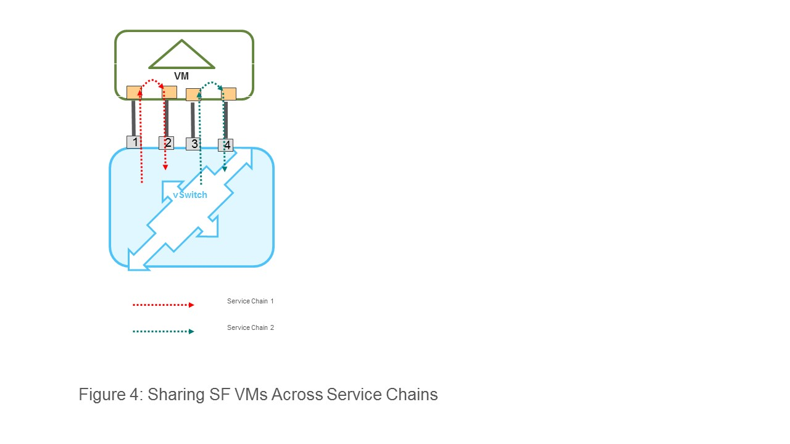
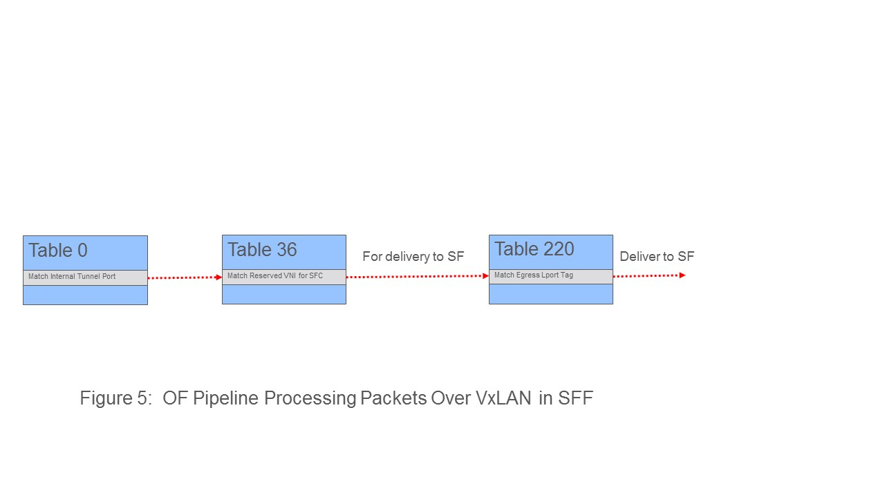

..
 Key points to consider:
  * Use RST format. For help with syntax refer http://sphinx-doc.org/rest.html
  * Use http://rst.ninjs.org/ a web based WYSIWYG RST editor.
  * For diagrams, you can use http://asciiflow.com to make ascii diagrams.
  * MUST READ http://docs.opendaylight.org/en/latest/documentation.html and follow guidelines.
  * Use same topic branch name for all patches related to this feature.
  * All sections should be retained, but can be marked None or N.A.
  * Set depth in ToC as per your doc requirements. Should be at least 2.

.. contents:: Table of Contents
   :depth: 3

===================================================
Non-NSH Dataplane Support For GENIUS Integrated SFC
===================================================

https://git.opendaylight.org/gerrit/#/q/topic:sfc-genius-non-nsh

In the previous releases the SFC feature was integrated with the GENIUS architecture as part of SFC-Netvirt integration.
However, NSH based forwarding plane for service chained packets was retained with GENIUS integrated SFC.

This feature targets the implementation of NSH-less data plane for GENIUS integrated SFC
- i.e. both SFFs (switches, i.e. OVS) and service functions (SF)do not support NSH in such a data plane.  The feature
does not mandate changes in the SFC orchestration APIs - only the SFC encapsulation in the dataplane is impacted.

This feature does not propose any changes in the orginal SFC dataplane (i.e. SFC not integrated with GENIUS,
`SFC OpenFlow Switch Flow pipeline
<http://docs.opendaylight.org/en/stable-nitrogen/user-guide/service-function-chaining.html#sfc-user-guide-sfc-of-pipeline>`__)
Only the the dataplane of the GENIUS integrated SFC is impacted (`SFC pipeline impacts
<http://docs.opendaylight.org/en/stable-nitrogen/user-guide/service-function-chaining.html#sfc-pipeline-impacts>`__).

Problem description
===================
The NSH based data plane in the existing GENIUS integrated SFC  poses the following problems:

1) NSH implementation support is mandated even in SFs. But many of the commercial SFs do not support NSH as yet.
Although the SFC proxy defined in the orginal SFC architecture is meant to solve this problem, the NSH proxy
implementation is not going to be available anytime soon on OVS based SFFs.

2) The VxLAN-GPE encapsulation used for tranporting NSH does not gel well with GENIUS architecture, which uses
a mesh of traditional VxLAN tunnels between vSwitches to carry packets on other services (e.g. L3VPN, ELAN).
That is, seperate VxLAN-GPE tunnels have to be created between SFFs (OVS) inspite of the availability of the
traditional VxLAN mesh created by GENIUS.

Use Cases
==================
This feature introduces a new "all non-NSH" data plane. That is, a config knob specifies if SFC dataplane
supports NSH (default) or not.

The "all non-NSH" forwarding plane accomplishes the following:
SFC packet forwarding between the classifier and the first SFF in a RSP without NSH.
Packet forwarding across the SFFs without NSH.
Packet forwarding between SFFs and SFs without NSH.
The "classify once" semantics of SFC architecture is to be retained. That is, absense of NSH on the packet
does not mandate heavy duty classification functionality on intermediate SFFs/switches along an RSP.
The SFC data model for various SFC elements (SFC, SFP, RSP, SF, SFF etc.) are not be changed. Only the
dataplane transport encapsulation is changed.
It does not introduce any new GENIUS service. It re-uses the existing two SFC services, namely
SFC Classifier Service and SFC Service defined in the earlier SFC GENIUS integration project.

The proposal does NOT
---------------------
Provide an an alternative to carry metadata on a NSH-less data plane. It only provides an alternative method
to steer packets along RSPs without NSH.
Support a mix of data plane hops on the RSP - e.g. a subset of hops in a RSP supporting NSH.

(A later section lists further limitations and potential future enhancements).

Proposed Changes
================

Orchestration & REST API Changes
--------------------------------
The orchestration and REST APIs for configuration of service chains are not changed.

A new global flag indicates if the dataplane supports NSH or not. If the global flag indicates an NSHless data plane,
the per service function "nsh-aware" flag is ignored.

If the global flag indicates NSH based data plane this entire feature does not come into effect - i.e. the implementation
(i.e. the entire pipeline) completely falls back to the existing GENIUS integrated SFC implementation.

VxLAN GPE Tunnels
-----------------
If the global flag indicates "non-NSH" data plane, the SFC logic does not create VxLAN-GPE tunnel ports on SFF vSwitches.

Packet Flow Along RSP
---------------------
.. figure:: ./images/packet-flow-on-rsp.jpg
   :alt: Packet Flow on RSP

The dotted arrows in the figure above show the packet flow along an RSP.

GENIUS SFC services, namely SFC Classifier Service and and SFC Services are used only at VM ingress/egress points.

VxLAN Encapsulation Between vSwitches
-------------------------------------

The GENIUS ITM tunnel mesh already provides the transport between SFFs (vSwitches).

We propose to use a reserved set of VNIs, that do not overlap with the regular L2/L3 VNIs to carry the packet
between the vSwitches. A global VNI range meant exlusively for Netvirt-GENIUS services is configurable in
ODL (example usage can be found in Netvirt SNAT). This consiguration can be used to avoid VNI overlap across
traditional L2/L3 services and other services.

For every hop within a RSP a seperate VNI will be used. This is because a VNI carried between two SFFs is
overloaded with both [NSP + NSI] information.

When the classifier and the first SFF are co-located on the same vSwitch, the NSP & NSI are passed in packets
metadata/OVS registers.

SFF <==> SF Packet Flow
-----------------------

The SFs are expected to be "two legged" VMs - i.e. they have atleast two points of connections to the attached
SFF vSwitch. Sample options for creating such SFs for OpenStack orchestrated VMs are shown in the figure below.
In the GENIUS service the connection points are modeled as VLAN Interfaces (tagged/untagged).

Using VLANs is similar to the approach discussed in section 3.1.2 in the IETF draft - `SFC Header Mapping for Legacy SF
<https://tools.ietf.org/html/draft-song-sfc-legacy-sf-mapping-07>`__

The two legs are needed to identify directionality of packets along an RSP. If the packets in the forward direction
enter and exit a SF VM via a pair of VLAN Interfaces, then the packets in the reverse direction enter and exit the SF VM
in reversed order of interfaces as shown below.

Sharing of SFs
--------------

Since "two legs" of a SF VMs have to be reserved exclusively for a service chain, sharing a SF VM across service chain
will need orchestration of additional pairs of legs as shown in the figure below.

Using multiple VLAN tagged sub-interfaces per vNIC is more suitable in this case as it reduces the number of vNICs on
shared SF VMs.

(Sharing of SF VMs across tenants needs a larger multi-tenancy support in SFC itself and it is out of scope of this
proposal.)

L2 v/s L3 SFs
-------------

With NSH encapsulation the original L2 header of the packet can be retained all along RSP (assuming SFs do not change
the L2 headers). With our approach, in the absense of NSH, when the packet it to be delieved to an SF from an SFF a
decision has to be made whether to change the DMAC to that of he SF. This depends on SF type, L3 or L2. Based on the
"l2-transparent" flag of service function type configuration, this decision is programed into the SFF vSwitch by ODL.

Handing Over Packet to Other Services
-------------------------------------

Packets arrving from the the last SF into an SFF vSwitch is handed over to the next GENIUS service using the GENIUS
service binding semantics. Typically the next service would be an L2/L3 service.

Case 1: The next service is L2 (i.e. ELAN service in GENIUS):
The VLAN Interface connecting the last SF to vSwitch (VLAN Interface 7 in the Figure 1 Example) should be a member of
the original ELAN of the packet (i.e. ELAN corresponding to VLAN Interface 1 in Figure 1 Example).
Only "l2-transparent" SFs should be used to retain the original DMAC.

Case 2: The next service is L3 (i.e. L3VPN service in GENIUS)
The VLAN Interface connecting the last SF to vSwitch (VLAN Interface 7 in the Figure 1 Example) should belong to the
original L3VPN of the packet (i.e. the L3VPN corresponding to VLAN Interface 1 in Figure 1 Example).

Mandating the last SF VMs having a leg in the packets orginal ELAN/L3VPN is a limitation as it is desirable to isolate
SF VMs from the regular L2/L3 domains. We intend to address this limitation in the next ODL release.

OpenFlow Pipeline Changes
-------------------------
In order to minimize the changes in the existing GENIUS integrated SFC pipeline this proposal intends to retain
the current tables and not inroduce any new tables.

The matches and actions in those tables will be changed to accomplish NSH-less forwarding. The exiting pipeline is
described here: `Service Function Chaining <http://docs.opendaylight.org/en/stable-nitrogen/user-guide/service-function-chaining.html>`__

In summary the, existing packet flow across OF tables as follows:

Packets Entering SFC Classifier service:

0(INGRESS_TABLE)->17(LPORT DISPATHCHER TABLE)->82(SFC_TRANSPORT_CLASSIFIER_TABLE)->83(SFC_TRANSPORT_INGRESS)->86(SFC_TRANSPORT_NEXT_HOP)->87(SFC_TRANSPORT_EGRESS)->220(EGRESS_TABLE)

Packets Entering SF service:
0(INGRESS_TABLE)->17(LPORT DISPATHCHER TABLE)->83(SFC_TRANSPORT_INGRESS)->86(SFC_TRANSPORT_NEXT_HOP)->87(SFC_TRANSPORT_EGRESS)->220(EGRESS_TABLE)

We propose the following changes in the existing SFC Tables:

Currently in SFC_TRANSPORT_INGRESS(83), SFC_TRANSPORT_NEXT_HOP(86) and SFC_TRANSPORT_EGRESS (87) the NSP & NSI from the
NSH header are matched. With our approach even before the packet enters Table 83 NSP & NSI (derived from VNI or
VLAN Interface Id) in the packet metadata/registers. These are compared in tables 83,86 & 87.
In all the tables where NSH insertion actions would be replaced by just VNI setting in NXM_NX_TUN_ID or
metadata/registers (if the next hop is on local SFF).

The following changes are proposed in other tables:

1) When the packets arrive from SF VMs into SF VM, the LPORT dispatcher table on those ports identifies the NSP & NSI.
This is because ingress VLAN Interface determines both NSP & NSI.

2) When the packets traversing the GENIUS tunnel (between Classifier ==> SFF1 and SFF ==> SFF) arrive at the destination
SFF vSwitch they are processed in the internal tunnel table (36).
(Please see `Genius Pipeline <http://docs.opendaylight.org/en/latest/submodules/genius/docs/pipeline.html>`__).
The reserved VNI maching would be placed in table 36.

Yang changes
------------
Config flag leaf will be added to one of the yang model to differentiate between the nsh/non-nsh deployment.
This flag will be used to programm flows for nsh/non-nsh supported deployment.

Configuration impact
--------------------
"Non-NSH" configuration flag will be introduced. It defaults to NSH data plane.

Clustering considerations
-------------------------
None.

Other Infra considerations
--------------------------
None

Security considerations
-----------------------
None

Scale and Performance Impact
----------------------------
There is no scale impact on ODL.

However, this approach introduces one more service which demands its share in the avaiable VNI space.
The VNI pool is shared across GENIUS services.

Targeted Release
----------------
Oxygen

Limitations and Future Plans
----------------------------
Load balancing and HA of SFs attached to different SFFs is not planned to be addressed in this release.
This requires integration of non-NSH dataplane with the load balancing logic of the Logical SFF construct.
As discussed earlier, our approach the last SFF needs to have "leg" in tenant L2/L3 domains.
We are planning to address this limitation in the next release.
Multi-DC SFCs are not addressed as they might require inter-DC VxLAN tunnels with our approach.

Alternatives
------------
There are several non-NSH alternatives discussed in various IETF drafts and projects for creation of a
service chain data plane.  (e.g. Segment Routing with MPLS). But non of them fit into the GENIUS architecture
and hence a design approach that is closest to GENIUS architecture is chosen.

Usage
=====
The usage is similar to SFC GENIUS integration feature in netvirt.
The only difference is that the VMs have to orchestrated to have "two legs".

Features to Install
-------------------
odl-sfc-openflow-renderer

REST API
--------
TBU

CLI
---
No new CLI commands are introduced.

Implementation
==============

Assignee(s)
-----------

Primary assignee:
  Vinayak Joshi <vinayak.joshi@ericsson.com>

Other contributors:
  D Arunprakash <d.arunprakash@ericsson.com>

Work Items
----------
SFC logic to consume the global flag (i.e. not programming VxLAN GPE).
Classifier pipeline modifications to hand over the packets to SFC without NSH.
Forwarding the packets along RSP and handover.

Dependencies
============
This implementation will have dependency on GENIUS.

Testing
=======

Unit Tests
----------
TBU

Integration Tests
-----------------

CSIT
----
TBU

Documentation Impact
====================
TBU

References
==========
