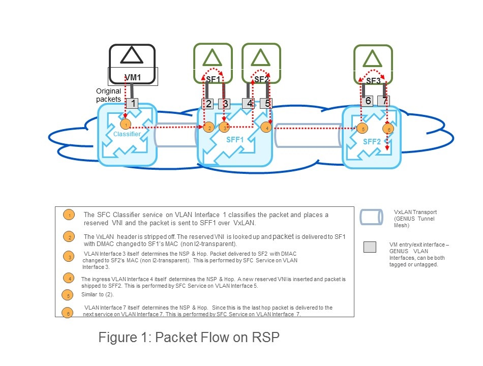
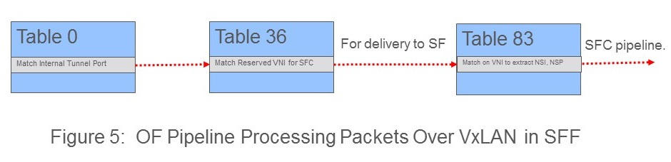

.. contents:: Table of Contents
   :depth: 3

===================================================
Non-NSH Dataplane Support For GENIUS Integrated SFC
===================================================

https://git.opendaylight.org/gerrit/#/q/topic:sfc-genius-non-nsh

In the previous releases the SFC feature was integrated with the GENIUS architecture.
Here SFC was integrated as a new Netvirt service (similar to L3VPN, ELAN) using GENIUS. However, NSH based forwarding
plane for service chain data plane was retained with GENIUS integrated SFC.

This feature targets the implementation of NSH-less data plane for GENIUS integrated SFC - i.e. both SFFs (switches,
i.e. OVS) and service functions (SF) do not support NSH in such a data plane. This feature does not mandate changes in
the SFC orchestration APIs - only the SFC encapsulation in the dataplane is impacted.

This feature does not propose any changes in the original SFC dataplane, i.e. the SFC-Netvirt dataplane before GENIUS
integration `SFC OpenFlow Switch Flow pipeline
<http://docs.opendaylight.org/en/stable-nitrogen/user-guide/service-function-chaining.html#sfc-user-guide-sfc-of-pipeline>`__).
Only the the dataplane of the GENIUS integrated SFC is impacted (`SFC pipeline impacts
<http://docs.opendaylight.org/en/stable-nitrogen/user-guide/service-function-chaining.html#sfc-pipeline-impacts>`__).

Problem description
===================
The NSH based data plane in the existing GENIUS integrated SFC poses the following challenges:

1) NSH implementation support is mandated even in SFs. But many of the commercial SFs do not support NSH as yet.
Although the SFC proxy defined in the orginal SFC architecture is meant to solve this problem, the NSH proxy
implementation is not going to be available anytime soon on OVS based SFFs.

2) Services integrated with GENIUS (e.g. L3PVN, ELAN etc.)use traditional VxLAN transport mesh set-up by GENIUS.
However, passing NSH encapsulated packets across SFFs requires the VxLAN-enhancement over traditional VxLAN.
This mandates two different types of tunnels between vSwitches when SFC is deployed with other GENIUS services.
In OPNFV, GENIUS was enhanced to support an all VxLAN-GPE transport mesh thus bringing in uniformity.
It still has the drawback that existing deployments using GENIUS for other services have to migrate to VxLAN-GPE
if intend to add support for SFC service.

Use Cases
=========
The "all non-NSH" forwarding plane accomplishes the following: .
SFC packet forwarding between the classifier and the first SFF in a RSP without NSH.
Packet forwarding across the SFFs without NSH.
Packet forwarding between SFFs and SFs without NSH.
The "classify once" semantics of SFC architecture is to be retained. That is, absense of NSH on the packet does not
mandate heavy duty classification functionality on intermediate SFFs/switches along an RSP.
The SFC data model for various SFC elements (SFC, SFP, RSP, SF, SFF etc.) are not be changed. Only the dataplane
transport encapsulation is changed.
It does not introduce any new GENIUS service. It re-uses the existing two SFC services, namely SFC Classifier Service
and SFC Service defined in the earlier SFC GENIUS integration project.

The proposal does NOT:
Provide an an alternative to carry metadata on a NSH-less data plane. It only provides an alternative method to steer
packets along RSPs without NSH.
Support a mix of data plane hops on the RSP - e.g. only a subset of hops in a RSP supporting NSH.

(A later section lists further limitations and potential future enhancements).

The proposal does NOT
---------------------
Provide an an alternative to carry metadata on a NSH-less data plane. It only provides an alternative method
to steer packets along RSPs without NSH.
Support a mix of data plane hops on the RSP - e.g. a subset of hops in a RSP supporting NSH.

(A later section lists further limitations and potential future enhancements).

Proposed Changes
================

Orchestration & REST API Changes
--------------------------------
The orchestration and REST APIs for configuration of service chains are not changed. The existing configurations and
REST APIs of SFC are used as below to accomplish a total non-NSH forwarding plane.

1) The "nsh-aware flag in service-function-type-definition grouping (please see file service-function-type.yang)
is to bet set to false for every SF. This indicates the need for SFC proxy between the SF and the SFF it is connected.

2) The "tranport-type" is to be set to "vxlan" instead of the default "vxlan-gpe" for all SFPs
(please see file service-function-path.yang).
This indicates that the transport encapsulation between SFF <==> SFF and Classfier ==> SFF would be traditional VxLAN,
which cannot ship NSH encapsulated packets across.

Thus, above two configurations imply a complete non-NSH forwarding plane for SFC.

VxLAN GPE Tunnels
-----------------
If the global flag indicates "non-NSH" data plane, the SFC logic does not create VxLAN-GPE tunnel ports on SFF vSwitches.

Packet Flow Along RSP
---------------------

The dotted arrows in the figure above show the packet flow along an RSP.

GENIUS SFC services, namely SFC Classifier Service and and SFC Services are used only at VM ingress/egress points.

VxLAN Encapsulation Between vSwitches
-------------------------------------
If the SFC transport-type is configured to be vxlan, SFC will relies on GENIUS VxLAN mesh for inter vSwitch transport.

P.S.: The SFC does not need the full mesh as such. It would use a subset of the full mesh of VxLAN tunnels to ship
packets across SFF <==> SFF a Classifier ==> SFF hops.

We propose to use a reserved set of VNIs, that do not overlap with the regular L2/L3 VNIs to carry the packet between
the vSwitches. A global VNI range meant exlusively for Netvirt-GENIUS services is configurable in ODL already
(example usage can be found in `Netvirt SNAT <http://docs.opendaylight.org/en/stable-nitrogen/submodules/netvirt/docs/specs/vni-based-l2-switching-l3-forwarding-and-NATing.html#nat-service>`__).
This consiguration can be used to avoid VNI overlap across traditional L2/L3 services and other services as below.

a) Firstly the user ensures that the VNI range used by orchestrators (e.g. OpenStack) for L2 networks does not overlap
with the set of VNIs used by Netvirt-GENIUS. This is ensured by configuring seperate ranges the former as part of
OpenStack Neutron configuration and the later as Netvirt-GENIUS REST API.

b) Once VNI range is available to GENIUS other services can request GENIUS for unique VNIs for their use.
The Id Manager module in GENIUS ensures that it allocates unique VNIs within the VNI range to the requesters.

Both (a) and (b) are already implemented in Netvirt-GENIUS.

The SFC module can directly request the Id Manager for a unique VNI without going via Netvirt. This avoids any
circular dependencies between the SFC and the Netvirt code.

For every hop within a RSP a seperate unique VNI will be used. This is because a VNI carried between two SFFs is
overloaded with both [NSP + NSI] information. Hence, when a packet arrives at an SFF vSwitch from the preceding SFF
or the classifier, based on the VNI carried in the packet the following can be determined:

1) The RSP the packet belongs to.
2) The hop within the RSP.

With the above information is sufficient to determine the next course of action for the packet - i.e. to forward it
to an SF connected to the SFF or hand it over to the next Netvirt service at the end of an RSP.

When the classifier and the first SFF are co-located on the same vSwitch, the NSP & NSI are passed in packets
metadata/OVS registers.

SFF <==> SF Packet Flow
-----------------------
The packets between SFFs and SFs can be either VLAN tagged or untagged. Modeling SF ports as tagged/untagged as a
"VLAN Interface" connection points is available in GENIUS. That is, an SF connects to SFF over a VLAN interface.
The VLAN interface can be just a OpenStack Neutron port (untagged) or a sub-port (tagged).

With our proposal when a packet arrives at an SFF from an SF, the ingress VLAN Interfrace on the SFF determines the
[NSP + NSI]. This is similar to the VNI identifying [NSP + NSI] described in the previous section. Using VLANs to
identify service chains is similar to the approach discussed in section 3.1.2 in the IETF draft - `SFC Header Mapping
for Legacy SF <https://tools.ietf.org/html/draft-song-sfc-legacy-sf-mapping-07>`__.

If an SF lies on a unidirectional service chain, it suffices to connect an SF to its SFF via a single VLAN Interface.
If the service chain happens to be bi-directional, the SFs are expected to be "two legged" VMs - i.e. they have atleast
two VLAN Interfaces connected to the attached SFF vSwitch. Sample options for creating such SFs for OpenStack
orchestrated VMs are shown in the figure below.

:alt: Two Legged VMs

The two legs are needed to identify directionality of packets along an RSP. If the packets in the forward direction
enter and exit a SF VM via a pair of VLAN Interfaces, then the packets in the reverse direction enter and exit the SF
VM in reversed order of interfaces as shown below.

:alt: Directionality of Service Chained Traffic

The "two legged" SF proposal is not being introduced as a new concept in this spec. It is already available in an
earlier spec - htps://github.com/opendaylight/sfc/blob/master/docs/specs/directional-dpl.rst.
We intend to re-use the concepts discussed here.

Sharing of SFs
--------------
Since the VLAN Interfaces ("legs") of a SF VMs have to be reserved exclusively for a service chain, sharing a SF VM
across service chain will need orchestration of additional pairs of legs as shown in the figure below.

:alt: Sharing SF VMs Across Service Chains

Consider the following Example of shared service functions:

1) Existing Service Chain with its RSP: Firewall(VM1) ==> NAT (VM2).
2) Newly Configured Service Chain: Firewall ==> Header Compression.

One option is to use a seperate instance of a Firewall VM for the new service chain.
But if the firewall VM (i.e. VM1) has to shared across service chains, the orchestrator has to introduce additional
VLAN Interfaces in VM1 (additional "two-legs" if the new chain is bidirectional). This can be performed as below:

1) If vNIC hot plugging is supported by the hypervisor and the orchestrator, new vNICs (connected to SFF vSwitch over
a VLAN Interface) can be added into VM1 seamlessly.

2) More VLAN tagged sub-interfaces can be added into VMs at run time. This approach is more suitable here it reduces
the number of vNICs on shared SF VMs.

(Sharing of SF VMs across tenants needs a larger multi-tenancy support in SFC itself and it is out of scope of this
proposal.)

SF VM Appearing Multiple Times on an RSP
----------------------------------------
There can be use cases where the same SF VM appears in multiple hops within an RSP. With out approach the [NSI+NSP]
determination on a and SFF on the SF ==> SFF segment is based on the ingress VLAN Interface on SFF. In such a scenario,
if the same VLAN Interface is used by an SF to send the packets to an SFF, the NSP determination logic fails. This is
similar to sharing SF VMs across service chains. Hence, even in this scenario orchestration of additional of VLAN
Interfaces is required.

L2 v/s L3 SFs
-------------
With NSH encapsulation the original L2 header of the packet can be retained all along RSP (assuming SFs do not change
the L2 headers). With our approach, in the absense of NSH, when the packet is to be delivered to an SF from an SFF a
decision has to be made whether to change the DMAC to that of he SF. This depends on SF type, L3 or L2. Based on the
"l2-transparent" flag of the service function type configuration, this decision is programed into the SFF vSwitch by ODL.

Handing Over Packet to Other Services
-------------------------------------

Packets arrving from the the last SF into an SFF vSwitch is handed over to the next GENIUS service using the GENIUS
service binding semantics. Typically the next service would be an L2/L3 service.

Case 1: The next service is L2 (i.e. ELAN service in GENIUS):
The VLAN Interface connecting the last SF to vSwitch (VLAN Interface 7 in the Figure 1 Example) should be a member of
the original ELAN of the packet (i.e. ELAN corresponding to VLAN Interface 1 in Figure 1 Example). Only "l2-transparent"
SFs should be used to retain the original DMAC.
Case 2: The next service is L3 (i.e. L3VPN service in GENIUS)
The VLAN Interface connecting the last SF to vSwitch (VLAN Interface 7 in the Figure 1 Example) should belong to the
original L3VPN of the packet (i.e. the L3VPN corresponding to VLAN Interface 1 in Figure 1 Example).

Mandating the last SF VMs having a leg in the packets orginal ELAN/L3VPN is a limitation as it is desirable to isolate
SF VMs from the regular L2/L3 domains. We intend to address this limitation in the next ODL release.

OpenFlow Pipeline Changes
-------------------------
In order to minimize the changes in the existing GENIUS integrated SFC pipeline this proposal intends to retain the
current tables and not inroduce any new tables.

However, in-order to maintain the uniformity of the NSH and non-NSH pipelines, the matches for [NSI + NSP] information
along the pipeline would be maintained in OVS registers/metadata.

The existing packet flow across OF tables (with NSH) as follows (http://docs.opendaylight.org/en/stable-nitrogen/user-guide/service-function-chaining.html)

Packets Entering SFC Classifier service:

  .. code-block:: bash
     :emphasize-lines: 1

0(INGRESS_TABLE)->17(LPORT DISPATHCHER TABLE)->82(SFC_TRANSPORT_CLASSIFIER_TABLE)->83(SFC_TRANSPORT_INGRESS)->86(SFC_TRANSPORT_NEXT_HOP)->87(SFC_TRANSPORT_EGRESS)->220(EGRESS_TABLE)

Packets Entering SFC service:

     .. code-block:: bash
     :emphasize-lines: 1

0(INGRESS_TABLE)->17(LPORT DISPATHCHER TABLE)->83(SFC_TRANSPORT_INGRESS)->86(SFC_TRANSPORT_NEXT_HOP)->87(SFC_TRANSPORT_EGRESS)->220(EGRESS_TABLE)

We propose the following changes in the existing SFC Tables:

1) Table 83 (SFC_TRANSPORT_INGRESS) extracts the [NSI+NSP} information from the packet and places them in
 registers/metadata. This is accomplished as below.
    a) If the packet carries NSH, the NSP and the NSI are available in the NSH metadata. It is copied over to registers
     as part of actions.
    b) In the non-NSH case, tanle 83 contains the match conditions on VNI and Lport Tags (corresponding to VLAN
     Interfaces) to determine the NSP and NSI and the actions to place those values in registers.

2) The remaining tables in the SFC pipeline (Table 86 & 87) match on the registers carrying the NSP & NSI. This keeps
 the pipeline fairly uniform.

3) The Classifier table has to place a VNI instead of NSH in the packet. This would be part of a seperate spec in the
 Netvirt project as this is outside the scope of SFC per se. This aspect is mentioned here just to provide a total picture.

The following changes are proposed in other non-SFC tables:

3) When the packets traversing the GENIUS tunnel (between Classifier ==> SFF1 and SFF ==> SFF) arrive at the destination
SFF vSwitch they are processed in the internal tunnel table (36). (Please see `Genius Pipeline <http://docs.opendaylight.org/en/latest/submodules/genius/docs/pipeline.html>`__).
The reserved VNI maching would be placed in table 36 and it hands over the packet to SFC pipeline (i.e. Table 83).

:alt: OF Pipeline Processing Packets Over VxLAN in SFF

Yang changes
------------
As described earlier, there are no Yang changes introduced with this proposal.

Configuration impact
--------------------
As there are no Yang changes with this proposal there is no configuratiom impact.
We re-use the existing SFC configurations an Netvirt-GENIOUS configurations.

Clustering considerations
-------------------------
None.

Other Infra considerations
--------------------------
None

Security considerations
-----------------------
None

Scale and Performance Impact
----------------------------
There is no scale impact on ODL in general.

However, our approach introduces one more service which demands its share in the avaiable VNI space.
The VNI pool is shared across GENIUS services.

Targeted Release
----------------
Fluorine

Limitations and Future Plans
----------------------------
Load balancing and HA of SFs attached to different SFFs is not planned to be addressed in this release.
This requires integration of non-NSH dataplane with the load balancing logic of the Logical SFF construct.
As discussed earlier, our approach the last SFF needs to have "leg" in tenant L2/L3 domains. We are planning
to address this limitation in the next release.
Multi-DC SFCs are not addressed as they might require inter-DC VxLAN tunnels with our approach.

Alternatives
------------
There are several non-NSH alternatives discussed in various IETF drafts and projects for creation of a service
chain data plane.  (e.g. Segment Routing with MPLS). But none of them fit into the GENIUS architecture and
hence a design approach that is closest to GENIUS architecture is chosen.

Usage
=====
The usage is similar to SFC GENIUS integration feature in netvirt.
The "tranport-type" and "nsh-aware" field configurations are described earlier.

Features to Install
-------------------
odl-sfc-openflow-renderer

REST API
--------
No changes are introduced as part of our proposal.

CLI
---
No new CLI commands are introduced.

Implementation
==============

Assignee(s)
-----------
Primary assignee:
  Vinayak Joshi <vinayak.joshi@ericsson.com>

Other contributors:
  Arunprakash D <d.arunprakash@ericsson.com>
  Manu B <manu.b@ericsson.com>

Work Items
----------
1) Forwarding across vSwitches - identifying NSP + NSI based on VxLAN.

2) SFC Miniproxy based on VLAN Interface.

3) Packet handover in the last SFF.

Dependencies
============
This implementation will have a dependency on GENIUS.

Testing
=======

Unit Tests
----------
Following unit test cases will be covered as part of implementation of NSH-less data plane for GENIUS integrated SFC,

* RSP contains non co-located classifier and SFF with SF attached. Check proper vlan id stamped between SFF and SF.
* RSP contains co-located classifier and SFF with SF attached. Check proper vlan id stamped between SFF and SF.
* RSP between two SFFs with SFs attahced on both SFFs. Check proper metadata information carried over via vxlan tunnel.

Integration Tests
-----------------

CSIT
----
Already existing CSIT covers nsh pipeline, so there is no enchancement/modification.
New CSIT suite will be added to cover the implementation of NSH-less data plane for GENIUS integrated SFC.

Documentation Impact
====================
None

References
==========
1. http://docs.opendaylight.org/en/stable-nitrogen/user-guide/service-function-chaining.html
2. http://docs.opendaylight.org/en/stable-nitrogen/submodules/netvirt/docs/specs/vni-based-l2-switching-l3-forwarding-and-NATing.html#nat-service
3. https://tools.ietf.org/html/draft-song-sfc-legacy-sf-mapping-07
4. http://docs.opendaylight.org/en/latest/submodules/genius/docs/pipeline.html